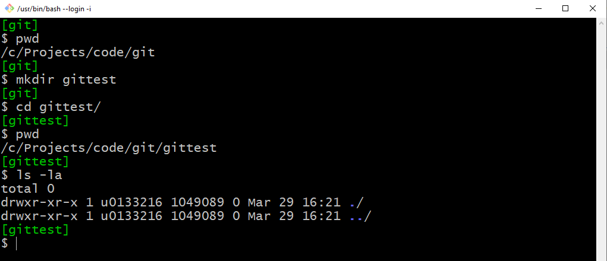

# Git Init: Je eerste git repository


## Maak een lokale directory (folder) 
* Waar maak je deze directory? Zie [tips](../999_allerlei/tips.md)
* Maak een nieuwe directory (folder)
  * bvb in de file-explorer 
  * je kan dit ook in Git Bash: start op de parent directory, dus de directory waarin je de nieuwe dir wil maken. 
  * Ik maak bvb een nieuwe dir "gittest" in de parent dir "c:/Projects/code/git". Dus mijn nieuwe dir is "**c:/Projects/code/git/git_init_mkdir**"      



* zie ook [linux en dos commando's](../999_allerlei/linux_en_dos_commandos.md)
* **pwd** = print working directory = huidige dir 
* **mkdir** = make new directory   
* **cd** = change directory (ga naar deze dir) 
* **ls** =  welke files staan in de huidige dir   
* **ls -la** = toon meer detail over de files (-l) en toon ook de hidden files (-a) 
* de directory is leeg: we zien enkel “.” (de huidige
  directory) en “..” (de parent directory).  
* check dit ook in file explorer

| je hebt nu een lokale directory | 
|---| 

* git werkt nog niet op deze directory. Als je het commando "git status" intikt dan krijg je een error.


## initialiseer deze directory voor git 
 ```
 git init
 git status
 ``` 

* Noot: je kan hetzelfde ook doen met [IntelliJ](06_git_init_met_intellij.md)
* We zorgen er nu voor dat we git kunnen gebruiken in deze directory.
* met andere woorden: we maken van onze directory een **git repository** 
* het git commando "**git status**" zegt je wat de status is van de repository


* Je ziet: “**On branch main**”: in het eerste deel van deze bundel werken we met 1 branch
(main). Hierover later meer.
* noot: in sommige versies van git is de default branch master ipv main
* Je ziet: “No commits yet”: dit betekent dat we nog geen commits gedaan hebben.
* We noemen je directory de “**working directory**”.
* Een **commit** is een **snapshot** van de working directory: daar zit alle info in waarmee je terug kan gaan naar de situatie op het moment van de commit. 

| je hebt nu een lokale repository | 
|---| 

## Commits toevoegen aan je lokale repository 

* Er zit nog niets in je repository. Geen files. Geen history.
* files in je working directory zijn ofwel:
  * **tracked**: wel gekend door git
  * **untracked**: niet gekend door git
* Maak een nieuwe file in je dir gittest. Dit is dus een untracked file.
* **Note**: Hoe maak je een nieuwe file?
  * Doe dit gewoon in je file explorer (new text file)
  * of je kan ook een file maken met het linux‐commando touch:
```touch <filename>```
* Note: Ik begin deze oefeningen altijd met ```cd gittest``` om expliciet aan te geven dat
  je dit in de directory gittest moet doen. 
* Voer nu de volgende commando’s uit in git‐bash:
  ```
  cd gittest
  git status
  <maak nu een file of pas een bestaande file aan>
  git status
  git add testfile.txt
  git status
  git commit -m “add first file”
  git status
  git log
  ```

* git ziet dat er aanpassingen gebeurd zijn op deze dir: 
    * we hebben een nieuwe file gemaakt
    * maar deze nieuwe file is nog niet gekend in git (untracked file)
* Het “**git add**” commando zet de aanpassingen klaar om te committen
  * in dit geval betekent dat: maak van deze file een tracked file - dus een file die gekend is in git.
* terminologie: "git add" =  een “**stage**” 
* Het "**git commit**" commando voegt deze aanpassing toe aan de history van deze repo. 
* Het is belangrijk dat je een commit message meegeeft (met de optie -m).     
* Het “**git log**” zie je al je commits: Je ziet dat er nu 1 commit (snapshot) in de
repository zit.
* De “**commithash**” is een unieke id voor de commit van 40 characters lang
  * Bvb: ab4cbe9baa470609fb277047a26db4a7eaaa3c52
* **Noot**: Je kan ook een add (stage) doen voor alle changes in 1 keer: 
```
    cd gittest
    git status
    <verander iets in een file> 
    git status
    <verander iets in een andere file>
    git add .
    git status
```
* **Noot**:
  * ```git add *``` voegt alle files deze directory toe
  * ```git add .``` voegt alle files in deze repository toe (ook in subdirectories)  

## Three States 


## De Git workflow 


## Oefening 
* Check telkens voor‐en‐na de situatie met “git status” en “git log”.
* Maak een aanpassing in de file en commit
* Voeg een tweede nieuwe file toe en commit
* Maak een aanpassing in de tweede file en commit

---
[prev](04_wat_is_een_git_repo.md)
[next](06_git_init_met_intellij.md)


