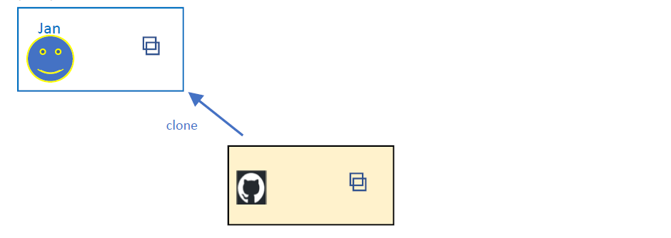
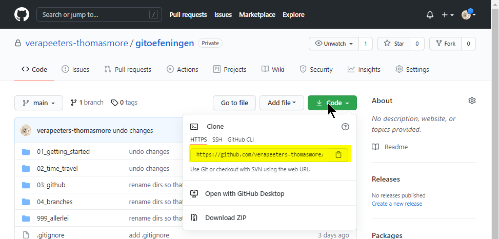

# Bestaande repo op Github 

* Hoe krijg je een repo die op github staat op je eigen computer? 
    * Optie 1: download als zip
        * dat gaan we **niet** doen
        * je verliest dan alle meta-data (extra informatie over het project zoals de history)
    * Optie 2: met **git clone**
        * je maakt dan een lokale git repo die verbonden blijft met de repo op github
        * de repo op github is de **remote repository**
        * de repo op je eigen computer is de **local repository**
* wat is git clone? 
    * dit commando maakt een lokale git repo die verbonden blijft met de repo op github
    * alle meta-data van de repo (zoals de history) blijft behouden in de lokale repo.   
    * de repo op github is de **remote repository**
    * de repo op je eigen computer is de **local repository**

## git clone deze repo (gitoefeningen)
* we maken een local repo (op je computer) die verbonden is met de repo die je nu aan het lezen hebt (gitoefeningen) 
* Doe dit in een directory die geen git-repo is 

|let op: nest geen repositories| 
|---|


* Zoek de “web URL van de repository”. Je vindt die op de Github pagina van het
  project:

  
### in Git Bash: 
* Ga naar je project folder  
* Noot: het “git clone” commando zal hier een nieuwe sub‐directory aanmaken.
```
cd c:/Projects
git clone <repository-url>
```
* Als je een tweede parameter meegeeft dan wordt dat de naam van de nieuwe directory:
````
git clone <repo‐url> testGithub”
````
* Git heeft een directory aangemaakt en alle files van de Github‐repository naar je lokale
computer gecopieerd. Check de inhoud van je lokale repository.


### in IntelliJ:  
* Menu > Git > Clone... 
  * Geef de url van de github repo en de directory waar je dit project wil hebben 
 of als IntelliJ geopend is in een project die niet in git zit:
    * Menu > VCS >  Get From Version Control...


## check de geconnecteerde remote  
* je kan zien welke remote repo verbonden is met een local repo (repo op je computer):
### In Git Bash: 
  * gebruik het commando "**git remote -v**"
      

### In IntelliJ: 
  * Menu > Git > Manage Remotes... 
      

## Oefening
* clone deze repository (gitoefeningen) 
* bekijk de inhoud in je lokale repo (bvb in IntelliJ)
* bekijk de history en experimenteer met de commando's die we al geleerd hebben 
* je kan committen! De commit blijft wel op je lokale repo (voorlopig). 

---
[prev](02_github_account.md)
[next](04_connect_existing_local_repo.md)
