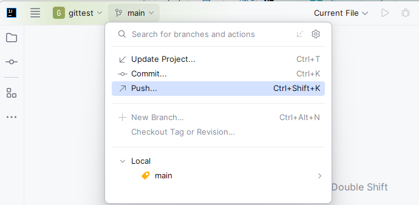

# Push en Pull

## Push 

* Je local repo is nu geconnecteerd met een remote repo op Github
* push = van waar je aan het werken bent NAAR GitHub 
* Je kan nu de **commits** van je local repo **pushen** naar de remote repo
* let op: dit kan alleen als je rechten hebt op de remote repo
  * dus als je mijn repo gecloned hebt dan kan je dit niet doen
  * je kan wel mijn remote repo [forken](06_fork.md) op Github


### in Git Bash:
* Noot: de eerste keer dat je push doet voor een (branch in een) remote repo moet je extra parameters meegeven:
```
git push -u origin main 
```
* Noot: main is de default branch in mijn project - gebruik hier master als dat jouw default branch is
* Je ziet nu je files op je remote repo op Github
* de volgende keer moet je de extra argumenten niet meer meegeven
```
git push
```


### in IntelliJ:
* gebruik het push symbool in de toolbar 

  
* of: <CTRL>-<SHIFT>-k
* of: in het git-tool-window onderaan selecteer je de huidige branch, rechts-klik en kies Push 
* Je ziet nu je files op je remote repo op Github


### Oefening
* op je eigen repo: [connecteer met github](04_connect_existing_local_repo.md) als dat nog niet gedaan is 
* pas een file aan, add, commit, push
* check op github of je de files daar ziet 


## Pull

* pull = van GitHub NAAR waar je aan het werken bent  
* resultaat: je ziet de aanpassingen in je code die gepushed waren naar GitHub 

### in Git Bash:
* de repo (en deze branch) is al geconnecteerd met GitHub
```
git pull  
``` 
* Je ziet nu de aanpassingen in de files op je lokale repo 


### in IntelliJ:
* IntelliJ noemt dit "Update" in plaats van "Pull" (jammer genoeg)
* Je ziet nu de aanpassingen in de files op je lokale repo in IntelliJ 


### Oefening
* op je eigen repo: [connecteer met github](04_connect_existing_local_repo.md) als dat nog niet gedaan is 
* clone deze repo een 2e keer op je laptop!!! Dus dezelfde url maar een andere folder
* Open ook dit nieuwe project in IntelliJ - je ziet dat de code identiek is als in je andere project  
* **IntelliJ-1** 
  * pas een file aan
  * add, commit, push
  * check op GitHub 
* **IntelliJ-2**
  * check: de code is niet veranderd
  * check: de git-hi/story is niet veranderd
  * selecteer de branch en Update 
  * check: de code is WEL veranderd
  * check: de git-hi/story is WEL veranderd
* Je kan deze oefening ook met 2 personen (op 2 laptops) doen ipv met 2 repositories op 1 laptop

## Fetch 
* merk op dat push en pull altijd slechts op 1 branch werken 
* In IntelliJ is het een goede gewoonte om dit in 2 stappen te doen: 
  * doe eerst "Fetch all remotes". 
    * Dit commando zorgt ervoor dat Git gaat kijken wat er aangepast is in GitHub, en het zal naast al je branches een passend symbooltje zetten  
  * doe dan pas "Update" van de (Local) branch  
    * de code aanpassingen worden nu actief gemaakt 
* Tip: Als je ziet dat een branch alleen Remote bestaat en niet Local, dan kan je deze lokaal binnentrekken met "Checkout"

### Oefening met Fetch 
* op je eigen repo: [connecteer met github](04_connect_existing_local_repo.md) als dat nog niet gedaan is
* clone deze repo een 2e keer op je laptop!!! Dus dezelfde url maar een andere folder
* Open ook dit nieuwe project in IntelliJ - je ziet dat de code identiek is als in je andere project
* **IntelliJ-1**
  * pas een file aan
  * add, commit, push
  * check op GitHub
* **IntelliJ-2**
  * check: de code is niet veranderd
  * check: de git-hi/story is niet veranderd
  * Fetch all Remotes 
  * check: de code is NIET veranderd
  * check: de git-hi/story is WEL veranderd
  * je ziet naast de (locale) branch een pijltje en een indicatie dat er incoming changes zijn!  
  * selecteer de branch en Update
  * check: de code is WEL veranderd
* Je kan deze oefening ook met 2 personen (op 2 laptops) doen ipv met 2 repositories op 1 laptop


---
[prev](04_connect_existing_local_repo.md)
[next](06_fork.md)


