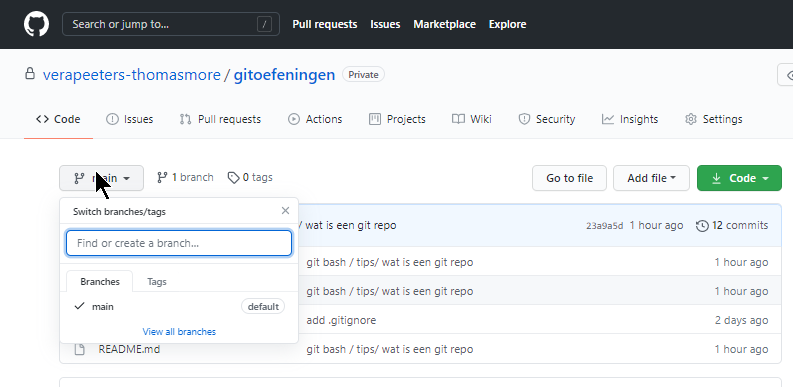

# Wat is een Git Repo? 

Om een idee te krijgen wat een repo is kijken we even rond in deze **Git Repo** [gitoefeningen](../README.md) op [GitHub](wat_is_github.md). 
* een git repo bevat gewoonlijk [plain text files](../allerlei/wat_is_md.md) (code is altijd plain text)
* de files zijn gestructureerd in **directories** (folders)
* je kan een file openklikken om de content te zien   
* in Github wordt de file **[README.md](../README.md)** getoond als info voor deze repo
* in de **[.gitignore](../getting_started/gitignore.md)** file staat welke files en directories nooit aan deze repo mogen toegevoegd worden  
* je kan gemakkelijk **zoeken** in alle files van een repo (Search of jump to...)
* je ziet de **[history](../getting_started/history.md)** van de repo
  

* je ziet verschillende **[branches](../getting_started/branches.md)** (bekijk dit pas als je de basis begrijpt)
  
* Deze repo staat nu op GitHub.  
* hoe krijg je deze files op je eigen computer?
  * download als zip  
    * dat gaan we **niet** doen 
    * je verliest dan alle meta-data (extra informatie over het project zoals de history)
  * [git clone](../getting_started/wat_is_github.md)
    * je maakt dan een lokale git repo die verbonden blijft met de repo op github 
    * de repo op github is de **remote repository** 
    * de repo op je eigen computer is de **local repository**

---
[prev](../getting_started/03_git_bash.md)
[next](../getting_started/05_git_init.md)