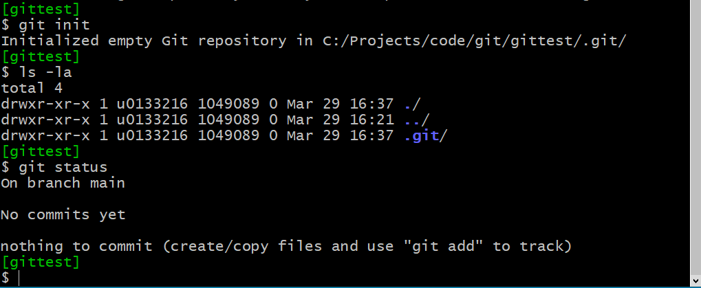

# Git Init: Je eerste git repository

## Maak een lokale directory (folder) 
* Waar maak je een directory? Zie [tips](../allerlei/tips.md)
* Maak een nieuwe directory (folder)
  * bvb in de file-explorer 
  * je kan dit ook in Git Bash: start op de parent directory, dus de directory waarin je de nieuwe dir wil maken. 
  * Ik maak bvb een nieuwe dir "gittest" in de parent dir "c:/Projects/code/git". Dus mijn nieuwe dir is "**c:/Projects/code/git/git_init_mkdir**"      


* pwd = print working directory = huidige dir 
* mkdir = make new directory   
* cd = change directory (ga naar deze dir) 
* ls =  welke files staan in de huidige dir   
* ls -la = toon meer detail over de files (-l) en toon ook de hidden files (-a) 
* de directory is leeg: we zien enkel “.” (de huidige
  directory) en “..” (de parent directory).  
* check dit ook in file explorer

| je hebt nu een lokale directory | 
|---| 

* git werkt nog niet op deze directory. Als je het commando "git status" intikt dan krijg je een error.


## initialiseer deze directory voor git 
 ```
 git init
 git status
 ``` 


* We zorgen ervoor dat we git kunnen gebruiken in deze directory.
* met andere woorden: we maken van onze directory een git repository 
* het git commando "git status" zegt je wat de status is 



* Je ziet: “On branch main”: in het eerste deel van deze bundel werken we met 1 branch
(main). Hierover later meer.
* noot: in sommige versies van git is de default branch master ipv main
* Je ziet: “No commits yet”: dit betekent dat we nog geen commits gedaan hebben.
* We noemen je directory de “**working directory**”.
* Een **commit** is een **snapshot** van de working directory.

| je hebt nu een lokale repository | 
|---| 

## Commits toevoegen aan je lokale repository 

## Three States 

## De Git workflow 

## Oefening 
* Check telkens voor‐en‐na de situatie met “git status” en “git log”.
* Maak een aanpassing in de file en commit
* Voeg een tweede nieuwe file toe en commit
* Maak een aanpassing in de tweede file en commit

---
[prev](../getting_started/04_wat_is_een_git_repo.md)
[next](../README.md)


